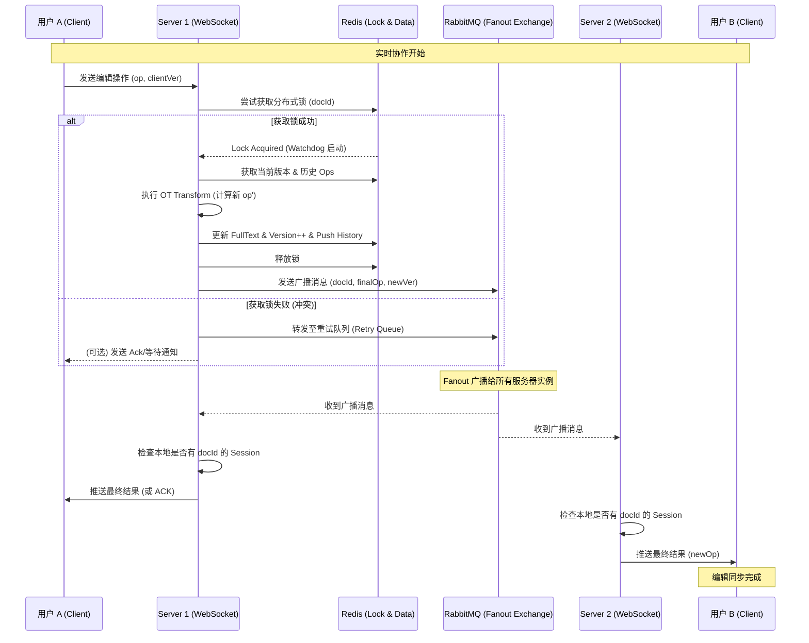
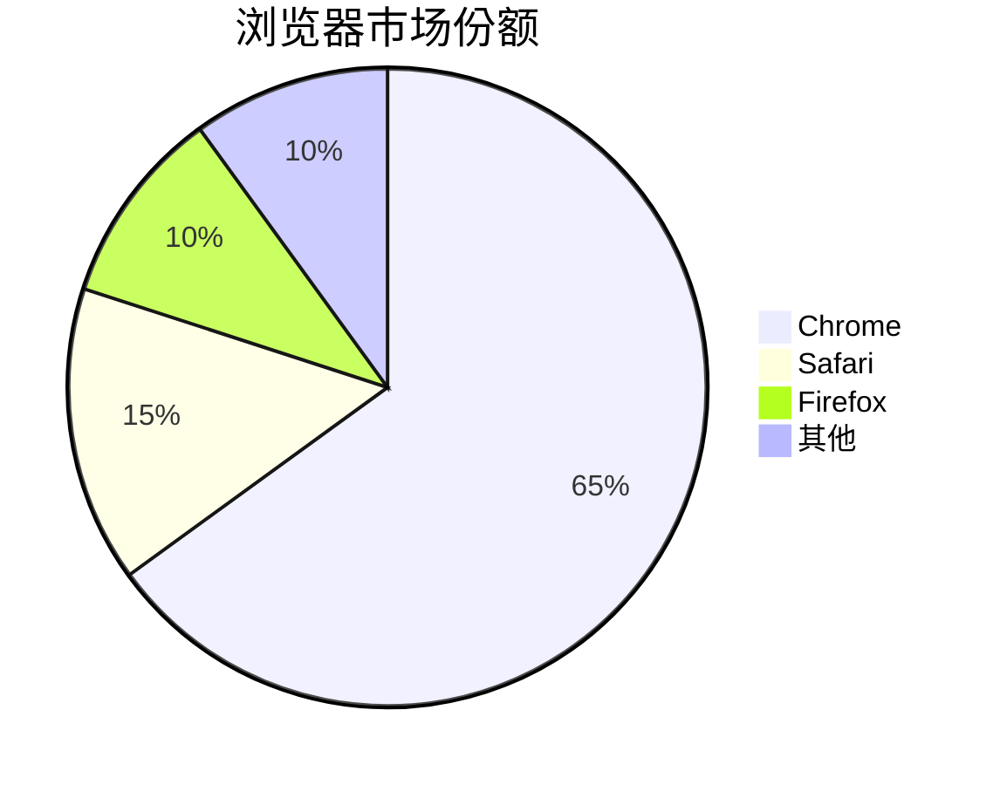
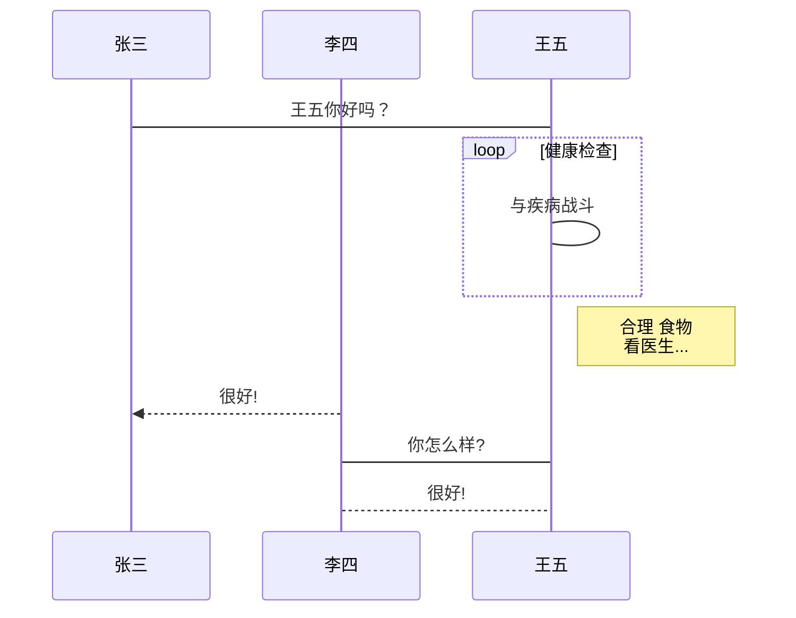
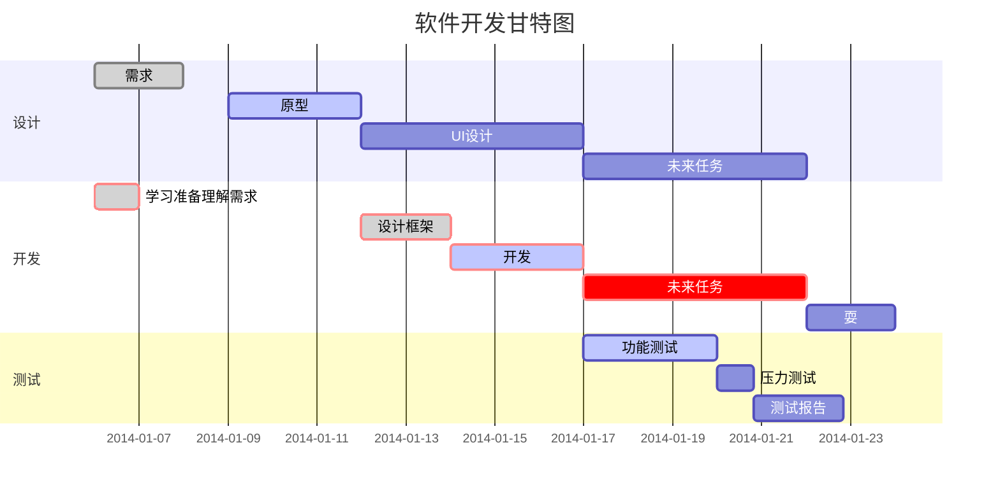

# MarkWeave - *正在开发*

**前端** : vite vue monaco-editor

**后端** : Spring Boot, WebSocket, MySQL, Redis, RabbitMQ, MinIO, OT 算法, SpringAI 

**项目描述**： 
- 该项目是一款实时 Markdown 协同编辑平台，支持多人在线同时编辑、AI 辅助创作及多格式转换。为解决协作过程中的内容冲突，自研了基于 OT算法的冲突协同模块，实现了高可用、低延迟的办公协作环境。

**todolist:**
- [x] 登陆jwt访问控制
- [x] 文件系统云盘服务
- [x] 文件权限管理服务
- [x] 后端/前端ot算法
- [x] 分布式系统设计，使用Redis作为分布式锁、缓存各个文档的版本号、操作列表
- [x] redis对文档读写请求的旁路缓存设计
- [x] afterConnectionClosed的分布式化
- [x] 分布式系统设计，使用RabbitMQ 传递消息、异步落库、延时重试
- [x] 重试机制下的TTL指数退避延时队列
- [x] ai生成服务
- [x] redis消息幂等处理
- [x] websocket数据封装
- [x] 前端超时重发
- [ ] 让ai的输出内容进行差量修正，而非全量修正
- [ ] ai接口限流、ai接口计费
- [ ] 解决在数据库里存文档的问题
- [x] 前端开发
- [ ] 前端undo/redo 栈
- [ ] handler的sessionMap内存溢出风险 (OOM)
- [ ] 开发管理员后台
- [ ] 性能监控：集成 Prometheus + Grafana
- [ ] 集成日志收集工具

**todolist**
- [ ] 需考虑使用RabbitMq的数据一致性
- [ ] 考虑前后端消息丢失的问题 ，测试其他几种情况

可以考虑的增强设计：

## 文件管理增强

| 功能 | 说明 |
|------|------|
| 批量操作 | 批量选择、移动、删除文件 |
| 文件搜索 | 全局搜索文件名、文件内容 |
| 视图切换 | 列表视图 / 网格缩略图视图 |
| 高级排序 | 按名称、时间、大小、类型排序 |
| 文件预览 | Markdown、图片在线预览 |
| 收藏夹 | 收藏常用文件/文件夹 |

## 协作体验优化

| 功能 | 说明 |
|------|------|
| 实时头像 | 显示在线协作者头像和光标位置 |
| 协作者聊天 | 侧边栏即时通讯 |
| 版本历史 | 查看文档历史版本 |
| 修订对比 | 版本差异对比视图 |
| 批注评论 | 在文档中添加评论 |

## 分享功能增强

| 功能 | 说明 |
|------|------|
| 二维码分享 | 手机扫码快速访问 |
| 有效期控制 | 设置链接过期时间 |
| 访问密码 | 链接密码保护 |
| 下载权限 | 允许/禁止下载源文件 |
| 访问记录 | 查看链接被谁访问过 |

## 用户体验提升

| 功能 | 说明 |
|------|------|
| 暗色模式 | 深色主题护眼 |
| 多语言 | 中英文切换 |
| 存储统计 | 可视化展示已用/总容量 |
| 最近访问 | 快捷访问最近打开的文件 |
| 快捷键 | 常用操作键盘快捷键 |

## 导入导出

| 功能 | 说明 |
|------|------|
| 批量导入 | 导入本地 Markdown 文件 |
| 导出 PDF | 文档导出为 PDF |
| 导出 HTML | 导出为 HTML 网页 |
| 导入外部 | 支持其他平台文档导入 |

---


尚未实现的后台管理系统设计：

## 用户管理模块

| 功能 | 说明 |
|------|------|
| 用户列表 | 查看所有注册用户，支持搜索、筛选 |
| 用户详情 | 查看用户基本信息、云盘容量使用情况 |
| 用户状态 | 启用/禁用用户、设置管理员 |
| 角色管理 | 不同角色的权限配置 |

## 内容管理模块

| 功能 | 说明 |
|------|------|
| 文档管理 | 查看所有文档，支持搜索、分类 |
| 回收站管理 | 恢复或彻底删除用户已删除的内容 |
| 共享管理 | 查看所有共享关系，取消恶意共享 |
| 协作管理 | 查看协作关系，处理协作纠纷 |

## 数据统计模块

| 功能 | 说明 |
|------|------|
| 用户统计 | 每日新增用户、活跃用户数 |
| 内容统计 | 文档总量、存储空间使用量 |
| 协作统计 | 协作次数、在线编辑并发数 |
| 流量统计 | API 调用次数、带宽使用 |

## 系统运维模块

| 功能 | 说明 |
|------|------|
| 系统配置 | 存储配额、协作超时设置 |
| 服务监控 | CPU/内存/磁盘使用率 |
| 告警设置 | 阈值告警、异常通知 |
| 日志审计 | 操作日志、登录日志 |

## 后台技术选型建议

```
前端：Vue 3 + Element Plus Pro
后端：Spring Boot (独立应用或与主应用共用)
认证：JWT + 管理员角色
```


### “为什么不用 RocketMQ？” 
“在 Markweave 的选型中，优先考虑的是实时交互的低延迟。RabbitMQ 基于 Erlang 开发，在消息转发的时延上具有微秒级的优势，非常适合 OT 算法的操作流同步。此外，RabbitMQ 灵活的 Exchange 模型能通过 Fanout 模式轻松实现 WebSocket 集群的广播，而 RocketMQ 的设计初衷更多是解决海量吞吐和事务一致性，对于这种实时办公场景，RabbitMQ 的性价比和响应速度更高。”


***分布式 OT 协作 UML 时序图***



## 为什么选择markdown？
- markdown 语法简单，轻松上手，无需繁杂点击，即可实现富文本特性
- markdown 规则简洁 可以轻松转化为其他格式的文件 html docx pdf ...
- markdown 扩展性高  呈现 Latex 图表 代码 思维导图 uml 手到擒来 
- markdown ai时代的基础设施，方便通过ai对md文档进gg行智能改写，提升工作效率
- markdown 非常轻量 节约空间

### `markdown` 应用

- 支持部分html语法
使用 <kbd>Ctrl</kbd>+<kbd>Alt</kbd>+<kbd>Del</kbd> 重启电脑

- 呈现数学表达式
$ f(x) = sin(x) + cos(x) $
$  \sum_{n = 1}^{100} n$
$$
\begin{Bmatrix}
   a & b \\
   c & d
\end{Bmatrix}
$$
$$
\begin{CD}
   A @>a>> B \\
@VbVV @AAcA \\
   C @= D
\end{CD}
$$

- 图表



| 功能 | 描述 | 状态 |
|------|------|:----:|
| **用户登录** | 支持邮箱和手机号登录 | &#x2705; |
| *密码重置* | 通过邮箱重置密码 | &#x26a0;&#xfe0f; |
| `API接口` | RESTful API 设计 | &#x2705; |
| [文档链接](https://example.com) | 查看详细文档 | &#x1f4d6; |

- 绘制 UML 图表




