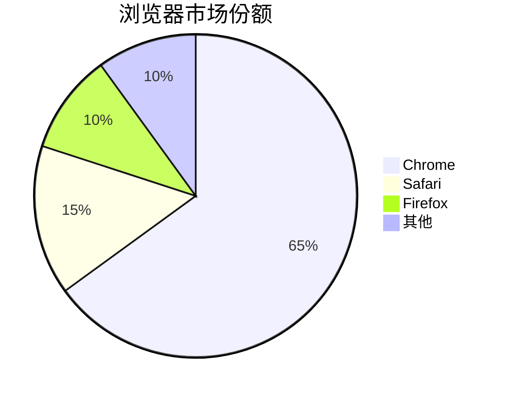
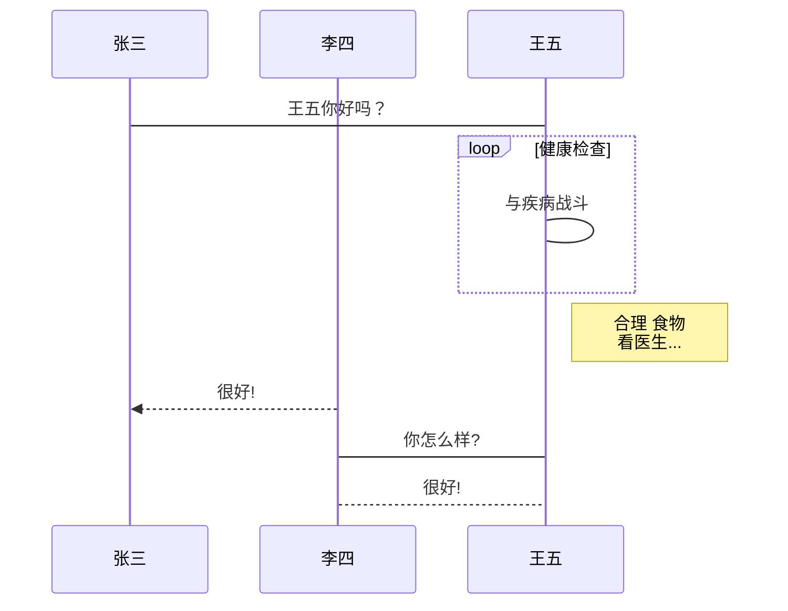
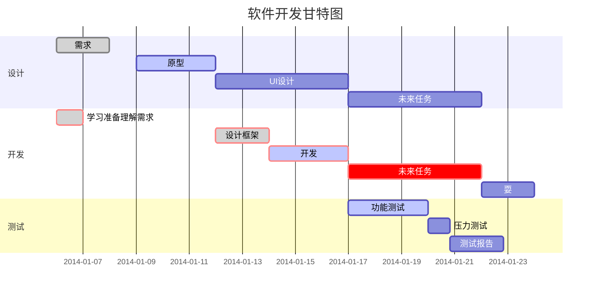

# MarkWeave - *正在开发*

**前端** : vite vue monaco-editor

**后端** : Spring Boot, WebSocket, MySQL, Redis, RabbitMQ, MinIO, OT 算法, SpringAI 

**项目描述**： 
- 该项目是一款实时 Markdown 协同编辑平台，支持多人在线同时编辑、AI 辅助创作及多格式转换。为解决协作过程中的内容冲突，自研了基于 OT算法的冲突协同模块，实现了高可用、低延迟的办公协作环境。

## 为什么选择markdown？
- markdown 语法简单，轻松上手，无需繁杂点击，即可实现富文本特性
- markdown 规则简洁 可以轻松转化为其他格式的文件 html docx pdf ...
- markdown 扩展性高  呈现 Latex 图表 代码 思维导图 uml 手到擒来 
- markdown ai时代的基础设施，方便通过ai对md文档进gg行智能改写，提升工作效率
- markdown 非常轻量 节约空间

### `markdown` 应用

- 支持部分html语法
使用 <kbd>Ctrl</kbd>+<kbd>Alt</kbd>+<kbd>Del</kbd> 重启电脑

- 呈现数学表达式
$ f(x) = sin(x) + cos(x) $
$  \sum_{n = 1}^{100} n$
$$
\begin{Bmatrix}
   a & b \\
   c & d
\end{Bmatrix}
$$
$$
\begin{CD}
   A @>a>> B \\
@VbVV @AAcA \\
   C @= D
\end{CD}
$$

- 图表

| 功能 | 描述 | 状态 |
|------|------|:----:|
| **用户登录** | 支持邮箱和手机号登录 | &#x2705; |
| *密码重置* | 通过邮箱重置密码 | &#x26a0;&#xfe0f; |
| `API接口` | RESTful API 设计 | &#x2705; |
| [文档链接](https://example.com) | 查看详细文档 | &#x1f4d6; |

- 绘制 UML 图表

