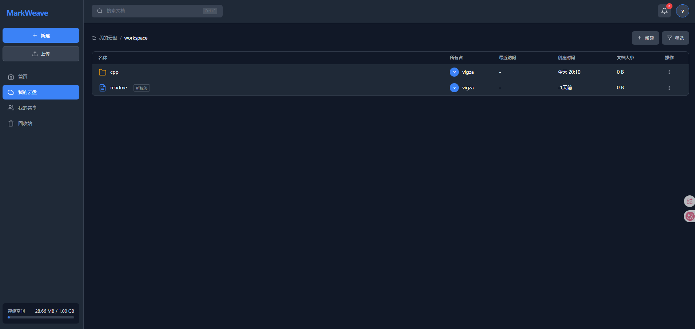
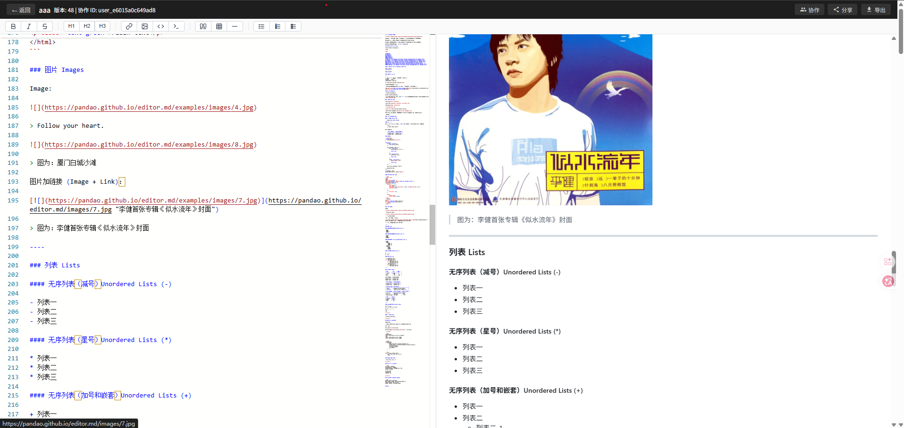
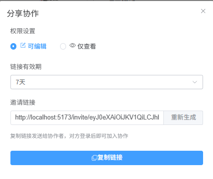
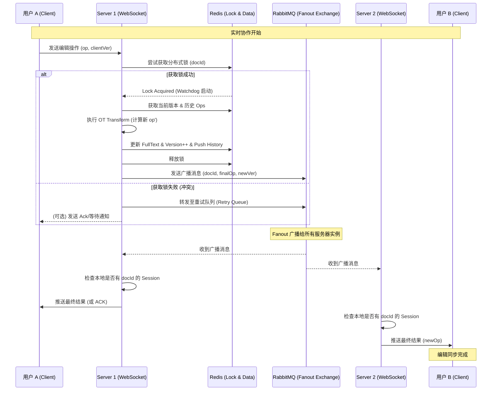

# MarkWeave 

**前端** : vite vue3 monaco-editor 

**后端** : Spring Boot, WebSocket, MySQL, Redis, RabbitMQ, MinIO, OT 算法 

**项目描述**： 
- 该项目是一款实时 Markdown 协同编辑平台，支持多人在线同时编辑、AI 辅助创作及多格式转换。为解决协作过程中的内容冲突，自研了基于 OT算法的冲突协同模块，实现了高可用、低延迟的办公协作环境。

> - 最近访问 收藏（未实现） 我的共享
> - 云盘层级系统 `快捷方式` `移动` `改名` ···· 
> - 文件协同权限管理 `只读` `可编辑`

> - markdown实时多人协作编辑
> - 右侧同步预览
> - 格式转化html/pdf导出
> - 协作者列表

**todolist:**
- [x] 登陆jwt访问控制
- [x] 文件系统云盘服务
- [x] 文件权限管理服务
- [x] 后端/前端ot算法
- [x] 分布式系统设计，使用Redis作为分布式锁、缓存各个文档的版本号、操作列表
- [x] redis对文档读写请求的旁路缓存设计
- [x] afterConnectionClosed的分布式化
- [x] 分布式系统设计，使用RabbitMQ 传递消息、异步落库、延时重试
- [x] 重试机制下的TTL指数退避延时队列
- [x] ai生成服务
- [x] redis消息幂等处理
- [x] websocket数据封装
- [x] 前端超时重发
- [ ] 让ai的输出内容进行差量修正，而非全量修正
- [ ] ai接口限流、ai接口计费
- [ ] 解决在数据库里存文档的问题
- [x] 前端开发
- [ ] 前端undo/redo 栈
- [ ] 开发管理员后台
- [ ] 性能监控：集成 Prometheus + Grafana
- [ ] 集成日志收集工具

***分布式 OT 协作 UML 时序图***

```mermaid
sequenceDiagram
    participant UserA as 用户 A (Client)
    participant S1 as Server 1 (WebSocket)
    participant Redis as Redis (Lock & Data)
    participant MQ as RabbitMQ (Fanout Exchange)
    participant S2 as Server 2 (WebSocket)
    participant UserB as 用户 B (Client)

    Note over UserA, UserB: 实时协作开始
    UserA->>S1: 发送编辑操作 (op, clientVer)
    
    S1->>Redis: 尝试获取分布式锁 (docId)
    alt 获取锁成功
        Redis-->>S1: Lock Acquired (Watchdog 启动)
        S1->>Redis: 获取当前版本 & 历史 Ops
        S1->>S1: 执行 OT Transform (计算新 op')
        S1->>Redis: 更新 FullText & Version++ & Push History
        S1->>Redis: 释放锁
        
        S1->>MQ: 发送广播消息 (docId, finalOp, newVer)
    else 获取锁失败 (冲突)
        S1->>MQ: 转发至重试队列 (Retry Queue)
        S1-->>UserA: (可选) 发送 Ack/等待通知
    end

    Note over MQ: Fanout 广播给所有服务器实例

    MQ-->>S1: 收到广播消息
    MQ-->>S2: 收到广播消息

    S1->>S1: 检查本地是否有 docId 的 Session
    S1->>UserA: 推送最终结果 (或 ACK)

    S2->>S2: 检查本地是否有 docId 的 Session
    S2->>UserB: 推送最终结果 (newOp)
    
    Note over UserB: 编辑同步完成
```

